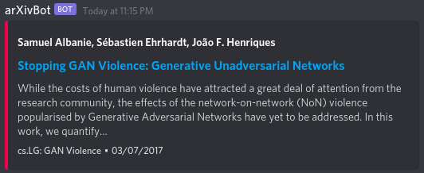

# arΧivBot, the arXiv Discord bot.


Save your team the trouble of searching for the most recent research papers.
Deploy arΧivBot and get a Discord message for every paper submitted to
[arXiv.org](https://arxiv.org/) that might be relevant according to your own
preferences.

To [activate the bot](https://discordpy.readthedocs.io/en/latest/discord.html):
1. 🚀 make a new application in the
[Discord activation portal](https://discord.com/developers/applications),
[create a bot](https://discordpy.readthedocs.io/en/latest/discord.html#creating-a-bot-account) and
[add it](https://discordpy.readthedocs.io/en/latest/discord.html#inviting-your-bot) to your Discord server.
2. 🛂 Copy the bot's key into a file called `key.py` which has the following contents:
   ```
    key = "<YOUR_SECRET_BOT_KEY_GOES_HERE>"
    ```
    Alternatively you an add a key in `cfg.yml`.
1. 📦 Make sure you have installed the necessary Python packages (see `requirements.txt`) in your Python environment.
2. ⚡️ Run `python3 bot.py`.
3. 🎉 Enjoy.

Have a look at `cfg.yml` for a bunch of parameters you can tweak, or just ask arΧivBot to do it for you via its Discord interface. In the default setting the bot will respond to messages starting with `!arXiv`.

## References
- The initial setup of this bot has been inspired by [this](https://github.com/perara/discord_arxiv) repository by [@perara](https://github.com/perara).
- More information on the used [Python interface for Discord](https://discordpy.readthedocs.io/).
- More information on the used [Python interface for arXiv](https://github.com/lukasschwab/arxiv.py).
- More information on the used [arXiv API](https://arxiv.org/help/api/user-manual).
